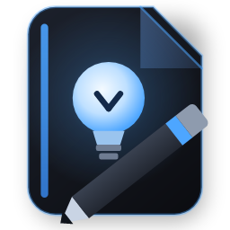

<p align="center">
  
</p>

<h1 align="center">Lumenotepad</h1>

<p align="center">
  <a href="https://dotnet.microsoft.com/en-us/download/dotnet/10.0"></a>
  <a href="https://avaloniaui.net/"></a>
  
  
  
</p>

Lumenotepad is a freeform note organizer for macOS and Windows, built with Avalonia.

Notes aren't documents in a list. Every page is a canvas, and you drop containers onto it wherever
you want, the way OneNote works. Each container holds its own rich text, and pages can also carry
tables, images, file attachments, annotated PDFs and mind maps.

It's a native app. There's no browser engine in it anywhere: PDF pages go through native PDFium, text
is laid out with Skia and HarfBuzz, and the window chrome is the real thing on both platforms, DWM
acrylic on Windows and `NSVisualEffectView` vibrancy on macOS.

## Contents

- [Highlights](#highlights)
- [Project Status](#project-status)
- [Install](#install)
- [Updates](#updates)
- [Requirements](#requirements)
- [Quick Start](#quick-start)
- [Publishing](#publishing)
- [User Data](#user-data)
- [Keyboard Shortcuts](#keyboard-shortcuts)
- [Architecture](#architecture)
- [Testing](#testing)
- [Troubleshooting](#troubleshooting)
- [Roadmap](#roadmap)
- [License](#license)

## Highlights

- **Freeform pages.** Click anywhere to start a container, then drag, resize and stack them.
  Containers you create and never type into tidy themselves away.
- **Notebooks, sections, pages.** Or a flat notebooks-to-pages mode if sections are more structure
  than you want.
- **Rich text** in a purpose-built editor: styles, highlights, bullet and numbered lists with
  configurable furniture, links, and per-notebook paper styles and templates.
- **Mind maps** with typed bubbles (title pill, information squircle, callout), labelled connectors,
  a nominated central bubble, and three auto-arrange layouts.
- **PDF viewing and annotation** through native PDFium, with highlights and notes over the page and a
  flattened-copy export.
- **Export** to Markdown, HTML, RTF, PDF, DOCX, PNG and EPUB.
- **Five themes.** Lumen (glass), Dark, Light, Pink and Light blue, with accent overrides, an optional
  accent that follows the open notebook, and adjustable corner roundness.
- **Real platform glass.** Acrylic on Windows, the system vibrancy materials on macOS, with a material
  picker because macOS has no blur-strength setting of its own.
- **Font browser and installer** that pulls faces from Google Fonts and Fontshare into the app's own
  font folder. Nothing gets installed system-wide.
- **Deleted-container history** per page, restorable by dragging back onto the canvas.
- **Automatic backups** to a folder you choose, with a retention count.

## Project Status

Under active development. Windows is the platform it grew up on. macOS is newer and gets most of the
testing attention right now.

| Area | Status |
| --- | --- |
| Windows desktop | Stable, the main development platform |
| macOS (Apple Silicon) | Working, actively tested |
| macOS (Intel) | Built and signed, not tested on hardware |
| Editor, canvas, notebooks | Stable |
| Mind maps | Stable |
| PDF annotation | Usable |
| Export formats | Usable |
| In-app updates | New in 1.2.0. Verified end to end on Windows, untried on macOS |
| Windows packaging | Setup wizard, download-on-install launcher, and a portable zip; beta |
| Code signing | Ad-hoc only, see [Install](#install) |

## Install

### macOS

Download the zip for your Mac, `arm64` for Apple Silicon or `x64` for Intel, unpack it, and
double-click **Install Lumenotepad.command**. It copies the app into Applications and opens it.

The first time, macOS blocks the installer because it isn't registered with Apple. Click **Done** on
the warning, then open System Settings, go to Privacy & Security, scroll down and click **Open
Anyway**. Double-click the installer again and it runs. That's one-time.

**Dragging the app across on its own does not work**, and the way it fails is misleading. macOS
reports "Lumenotepad is damaged and can't be opened" and offers no override. The bundle is fine. The
cause is that the app is ad-hoc signed rather than notarized, and macOS treats those two cases
differently:

| App state | Quarantined and opened | What you get |
| --- | --- | --- |
| Unsigned | Gatekeeper assesses | "could not verify", with an Open Anyway override |
| **Ad-hoc signed** | Gatekeeper assesses | **"damaged", with no override** |
| Ad-hoc signed | quarantine removed | Runs |
| Notarized | Gatekeeper assesses | Runs after one confirmation |

Because a signature is present, Gatekeeper validates it, finds no trusted authority and no
notarization ticket, and calls that "damaged". The installer sidesteps it by running `xattr -cr` on
the copy it places, so Gatekeeper never assesses it. The signature is still what lets it run at all,
since Apple Silicon refuses to execute unsigned Mach-O and a self-contained .NET publish ships around
220 unsigned dylibs. Signing happens at package time with
[rcodesign](https://github.com/indygreg/apple-platform-rs).

The installer is the supported path. It is a one-time cost per machine, not per release, because
in-app updates avoid the problem entirely: a build the app downloads itself is never quarantined, so
Gatekeeper never looks at it again.

### Windows (beta)

Three ways in, all landing on the same app. SmartScreen warns the first time with any of them, so
click "More info" then "Run anyway".

- **Setup** (`Lumenotepad-Setup-*.exe`) is the easy path. A short wizard installs per user into
  `%LocalAppData%\Programs\Lumenotepad`, so there is no administrator prompt, adds a Start menu
  entry, and registers a proper uninstall in Windows' Installed apps.
- **Launcher** (`Lumenotepad-Launcher-*.exe`) is the same wizard at a fraction of the download. It
  carries no copy of the app; it fetches the latest release when you install and verifies the
  download against the published hash before touching anything.
- **Portable zip** needs no install at all. Extract the folder somewhere **writable** and run
  `Lumenotepad.exe`. Don't extract it into `C:\Program Files`, because Windows blocks normal
  processes from writing there and saving would fail.

Whichever you pick, all user data lives in a `userdata` folder beside the executable, and nothing
else on the system is touched. Uninstalling offers to keep that folder, so notes survive a reinstall;
for a portable copy, deleting the folder is the whole uninstall.

## Updates

Both platforms update in place from Preferences, under **About**, with **Check for updates**. That
opens the updater window, which finds the right build for whichever OS is running, downloads it with
progress, verifies it and restarts into it.

On macOS this exists to get around Gatekeeper. An ad-hoc signature satisfies the kernel but not
Gatekeeper, so any build macOS sees arrive from a browser or a chat client is quarantined and costs
another trip through System Settings. That toll is per download, which means per release. The
quarantine flag is set by the application doing the downloading, not by the network, so a build the
app fetches itself is never marked. You pay the toll once on first install and never again.

On Windows the reason is different but the shape is the same. The build is portable, so updating
means replacing the program files around the `userdata` folder and leaving it alone. The swap uses
`robocopy` without `/MIR`, which is exactly what preserves your notebooks.

Downloads are SHA-256 verified before anything is unpacked. A running executable can't overwrite
itself on either OS, so both hand the swap to a detached script that waits for the app to exit first.
On macOS the old bundle is moved aside rather than deleted, so a failed swap rolls back.

## Requirements

- **Running:** macOS 13+, or Windows 10/11 x64. Nothing else to install, the builds are
  self-contained.
- **Building:** .NET 10 SDK.
- **Packaging macOS builds:** `cargo install apple-codesign`, which provides `rcodesign`. Runs on
  Windows or Linux, no Mac needed.
- **Regenerating icons:** `dotnet run --project tools/icongen`.
- **Regenerating the icon font:** Python with `fonttools`, then
  `python tools/lumenicons/build_lumenicons.py`.

## Quick Start

```bash
dotnet restore Lumenotepad.slnx
dotnet build
dotnet run --project src/Lumenotepad/Lumenotepad.csproj
```

## Publishing

All three scripts read the version from `<Version>` in `src/Lumenotepad/Lumenotepad.csproj`. That's
the single source of truth, so the binary, the macOS `Info.plist` and the update manifest can't drift
apart.

```bash
tools/publish-macos.sh
```

Publishes both architectures, code-signs each `.app`, and writes to `dist/`:

```text
Lumenotepad-macOS-<version>-arm64.zip
Lumenotepad-macOS-<version>-x64.zip
```

```bash
tools/publish-windows.sh
```

Writes `dist/Lumenotepad-<version>-win-x64-portable.zip`.

```bash
python tools/publish-manifest.py
```

Writes `dist/latest.json`, one manifest covering every platform, hashed from whatever zips are sitting
in `dist/`. `UpdateService.PlatformKey` picks its own entry (`macos-arm64`, `macos-x64`, `win-x64`), so
a single file on a single release serves both operating systems and nobody can be handed the wrong
build.

Platforms can ship under different tags. Windows goes out as a prerelease under its own tag so it
can't become GitHub's "latest" and hijack the macOS update check, and the manifest records that. For
the updater to find a release, the zips and `latest.json` both have to be uploaded to it. Override the
endpoints with `LUMENOTEPAD_RELEASE_BASE` when packing and `LUMENOTEPAD_UPDATE_URL` at runtime to test
the whole flow against a local file server.

## User Data

| Platform | Location |
| --- | --- |
| macOS | `~/Library/Application Support/Lumenotepad` |
| Windows | `userdata` beside `Lumenotepad.exe` (portable) |

They differ for a reason. The macOS app ships as a bundle that gets replaced wholesale on every
update, so data can't live inside it.

Either way it holds `settings.json`, the `notebooks` tree, installed `fonts`, and nothing else.
Installing or updating never touches it.

## Keyboard Shortcuts

Shortcuts use **Cmd on macOS** and **Ctrl on Windows**. The formatting ones are rebindable under
Preferences, in Shortcuts. The structural ones are fixed.

| Action | Shortcut |
| --- | --- |
| Bold / Italic / Underline | `Cmd/Ctrl` + `B` / `I` / `U` |
| Strikethrough | `Cmd/Ctrl` + `Shift` + `S` |
| Quick highlight | `Cmd/Ctrl` + `Shift` + `H` |
| Insert date & time | `Cmd/Ctrl` + `Shift` + `T` |
| Bullet / numbered list | `Cmd/Ctrl` + `Shift` + `8` / `7` |
| Copy / Cut / Paste | `Cmd/Ctrl` + `C` / `X` / `V` |
| Undo | `Cmd/Ctrl` + `Z` |
| Redo | `Cmd/Ctrl` + `Shift` + `Z`, or `Ctrl` + `Y` |
| Select all | `Cmd/Ctrl` + `A` |
| Word-wise motion | `Option` + `←`/`→` on macOS, `Ctrl` + `←`/`→` on Windows |
| Line start / end | `Cmd` + `←`/`→` on macOS, `Home` / `End` |
| Duplicate bubble | `Cmd/Ctrl` + `D` |
| New linked child bubble | `Tab` on a focused bubble |
| Open a hyperlink | `Cmd`-click on macOS, `Ctrl`-click on Windows |
| Zoom the canvas | `Cmd/Ctrl` + wheel, `Cmd/Ctrl` + `0` to reset |
| Pan horizontally | `Shift` + wheel |
| Summon the window (Windows) | `Ctrl` + `Alt` + `N`, if enabled |

## Architecture

```text
src/Lumenotepad/
  Editor/      the canvas and the rich-text engine (document model, layout, JSON persistence)
  Views/       windows, the main view, dialogs, popup effects, animation helpers
  ViewModels/  MainViewModel and the notebook draft model (CommunityToolkit.Mvvm)
  Services/    settings, themes, export, fonts, PDF rendering, backups, updates
  Platform/    the OS boundary: DWM acrylic, Win32 chrome, macOS vibrancy, window geometry
  Themes/      the Fluent-derived theme and control styles
tools/         icon generation, the icon-font builder, publishing scripts
tests/         xUnit coverage of the model, services and pure geometry
```

Two conventions worth knowing before changing anything:

- **`Platform/` is the only place with OS-specific code.** Every Win32 P/Invoke is guarded with
  `OperatingSystem.IsWindows()`, and the macOS side reaches AppKit through the Objective-C runtime
  because Avalonia doesn't surface what the glass needs.
- **Animation goes through `Views/Motion`,** not XAML transitions. Declarative transform transitions
  didn't run reliably in this build, so `Motion` drives them from a clock instead.

## Testing

```bash
dotnet test
```

307 tests covering the document model, canvas persistence, export formats, theme palettes, settings,
fonts, the keymap, PDF annotations and pure geometry. They're deliberately platform-agnostic. No test
needs a window, so the suite runs the same on either OS.

What tests can't cover is the platform chrome: glass, vibrancy, window tiling, Gatekeeper. Those need
a real machine on each OS.

## Troubleshooting

### macOS: the app won't open at all

If it bounces or dies immediately instead of showing the Gatekeeper dialog, suspect the ad-hoc
signature. Check what macOS actually objected to:

```bash
log show --predicate 'process == "Lumenotepad"' --last 5m
```

### macOS: the glass looks flat grey, or opaque

First check that Accessibility, Display, **Reduce transparency** is off. It disables vibrancy
system-wide and produces exactly this.

The app writes a diagnostics file on every launch saying whether macOS actually granted a frost layer:

```bash
cat ~/Library/Application\ Support/Lumenotepad/macos-chrome-diagnostics.txt
```

`frostLayers = 0` means the OS declined the frost, which is a different problem from the app asking
for it wrongly.

### macOS: glass disappears in full screen

Expected, and unfixable while the window is genuinely full screen. A native full-screen window owns
its Space and has nothing behind it, so behind-window vibrancy has no source to sample. Native full
screen is therefore disabled, and the green button zooms instead, which keeps the window on the
desktop and the glass intact.

### macOS: the glass is too bright, or too blurred

macOS has no blur-radius API. The `NSVisualEffectMaterial` is the recipe. Preferences, Glass,
**Glass material** switches between them, and the glass tint slider layers on top.

### Windows: notes won't save

The folder isn't writable, most likely because it was extracted into `C:\Program Files`. Move it
somewhere under your user profile.

## Roadmap

Near-term:

- Prove the macOS update path over a real release-to-release hop.
- Screenshots in this README once the macOS chrome settles.

Later:

- Sync between machines.
- A signed Windows installer, which needs the data directory moved to `%APPDATA%` first.
- A real DMG, which needs a macOS runner to build.

Not planned for now:

- **Notarization.** It would remove the installer step on macOS, but it costs an Apple Developer
  membership every year and the installer already handles it in one pass per machine. Worth
  revisiting only if this ever goes out to more than a handful of people.

## License

[GNU General Public License v3.0](LICENSE). In short: you can use, study, share and modify
Lumenotepad, but anything you distribute that's built from it has to carry the same freedoms and ship
its source. There's no warranty.

Every dependency is permissively licensed, MIT or BSD, so nothing here conflicts. Third-party
attributions are in [THIRD-PARTY-NOTICES.md](THIRD-PARTY-NOTICES.md).
